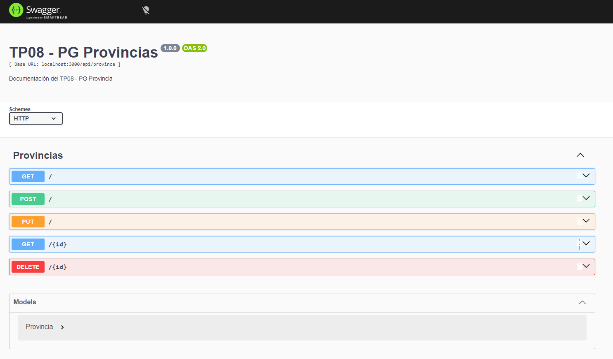
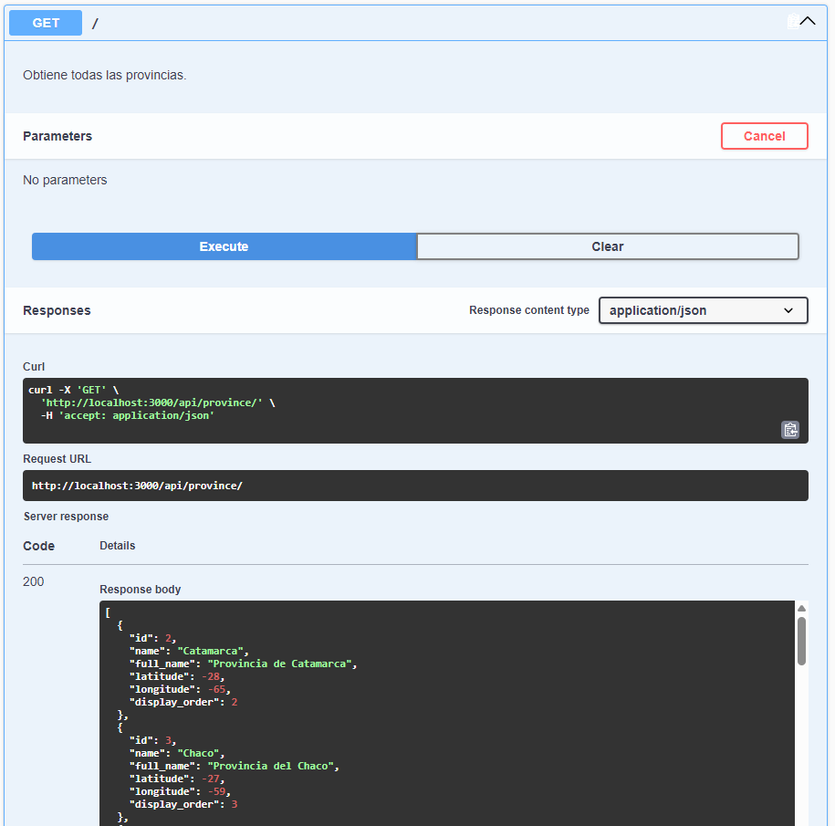
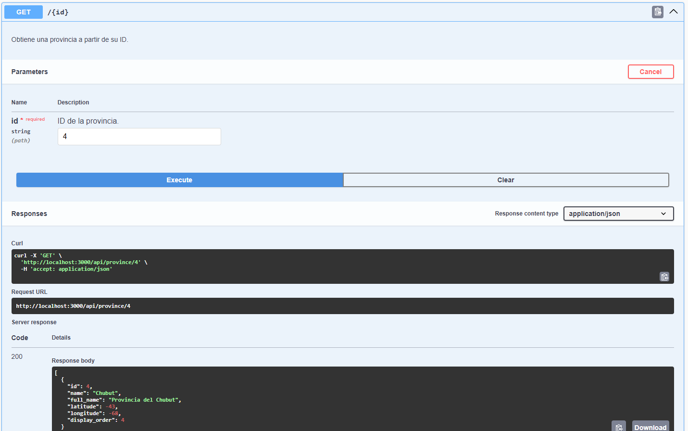
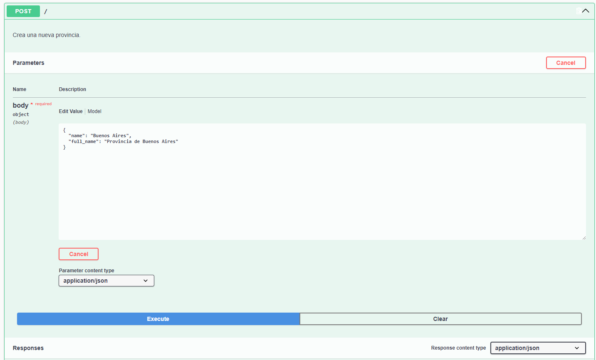
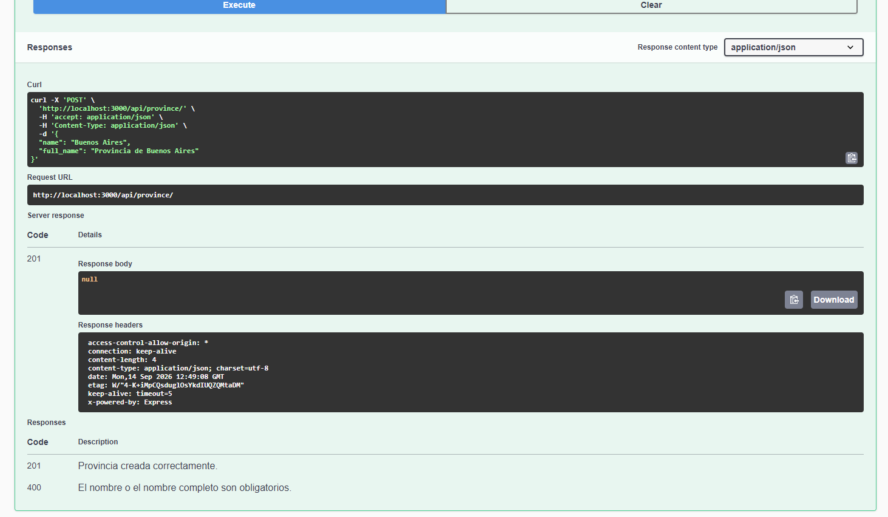
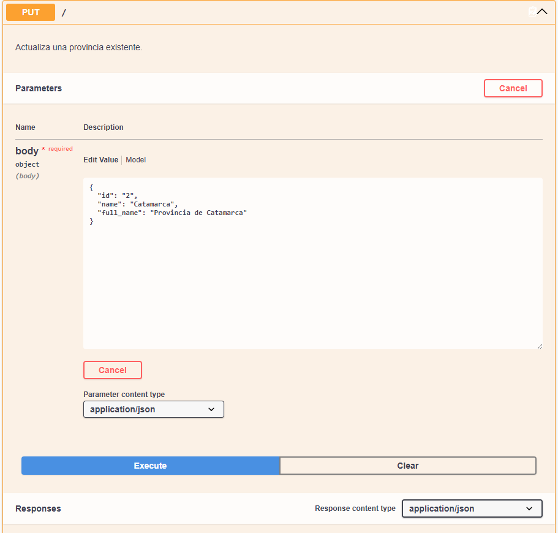
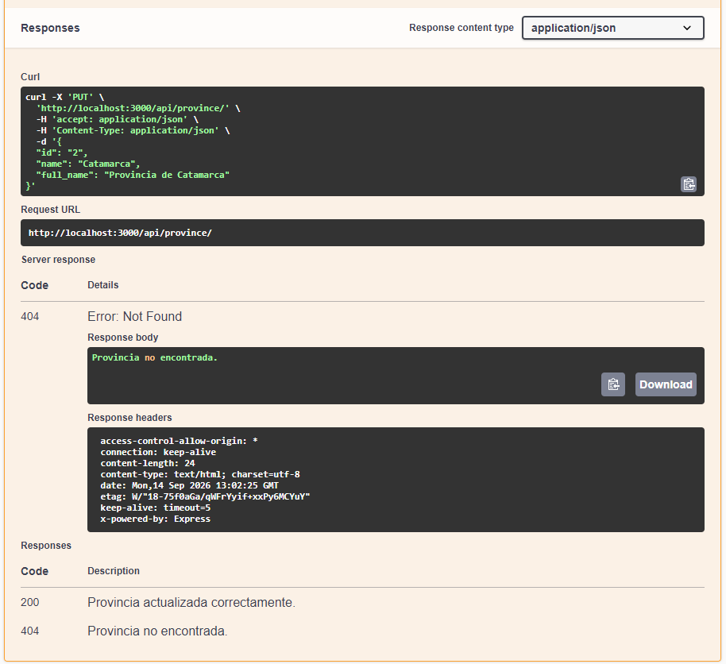
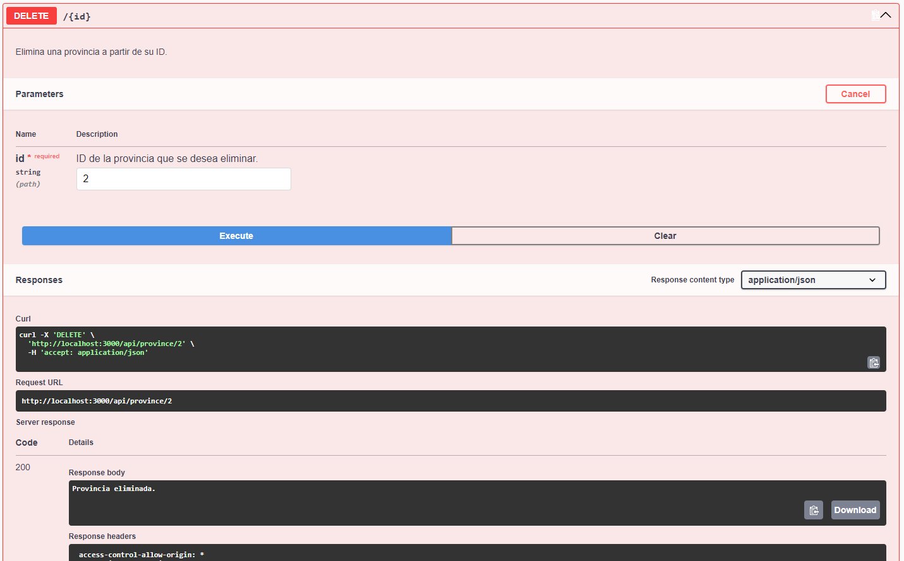

# TP04 - Provinces API

API REST desarrollada con **Node.js, Express y PostgreSQL** para gestionar información de provincias mediante operaciones CRUD.

## Tecnologías

* Node.js
* Express
* PostgreSQL
* `pg`
* CORS
* dotenv
* Nodemon
* DBeaver

## Estructura

```text
src/
├── configs/
├── controllers/
├── entities/
├── helpers/
├── repositories/
└── services/
```

La aplicación utiliza una arquitectura por capas para separar controladores, lógica de negocio y acceso a datos.

## Endpoints

| Método   | Endpoint            | Descripción                  |
| -------- | ------------------- | ---------------------------- |
| `GET`    | `/api/province`     | Obtener todas las provincias |
| `GET`    | `/api/province/:id` | Obtener una provincia por ID |
| `POST`   | `/api/province`     | Crear una provincia          |
| `PUT`    | `/api/province`     | Actualizar una provincia     |
| `DELETE` | `/api/province/:id` | Eliminar una provincia       |

La API contempla respuestas `200`, `201`, `400` y `404` según el resultado de cada operación y las validaciones de negocio.

## Instalación y configuración

### 1. Instalar dependencias

```bash
npm install
```

### 2. Configurar PostgreSQL

El proyecto utiliza una **base de datos PostgreSQL**, por lo que es necesario tener el servidor de PostgreSQL iniciado para que la API funcione correctamente.

En Windows:

1. Abrir **Servicios** (`services.msc`).
2. Buscar el servicio correspondiente a **PostgreSQL**.
3. Iniciar el servicio si se encuentra detenido.

### 3. Crear la conexión a la base de datos

Para este proyecto se utilizó **DBeaver** para administrar y ejecutar la base de datos. También es posible utilizar otras herramientas compatibles con PostgreSQL.

En DBeaver:

1. Crear una nueva conexión de tipo **PostgreSQL**.
2. Configurar los datos de conexión correspondientes.
3. Crear o seleccionar la base de datos del proyecto.
4. Ejecutar el **dump de la base de datos** para crear y cargar las tablas necesarias.

> **Importante:** la base de datos debe estar ejecutándose y correctamente configurada antes de iniciar la API. Sin la conexión a PostgreSQL, los endpoints que acceden a los datos no funcionarán.

### 4. Configurar las variables de entorno

Crear un archivo `.env` con los datos de conexión a PostgreSQL requeridos por el proyecto.

### 5. Ejecutar la API

```bash
npm run dev
```

Por defecto, el servidor utiliza el puerto `3000`.

## Pruebas

Los endpoints pueden probarse utilizando **Postman** mediante una colección de requests.

## Swagger

La API cuenta con documentación interactiva mediante **Swagger**, utilizando `swagger-autogen` para generar la especificación de la API y `swagger-ui-express` para visualizarla y probar los endpoints desde una interfaz web.

### Configuración

La documentación se genera a partir del archivo `swagger.js`, donde se define la información general de la API, el servidor, los endpoints y el modelo de datos `Provincia`.

El archivo generado es:

```text
swagger-output.json
```

Además, se documentó el modelo `Provincia` con sus propiedades y tipos de datos:

* `id`: integer
* `name`: string
* `full_name`: string
* `latitude`: integer
* `longitude`: integer
* `display_order`: integer

Swagger UI se encuentra integrado en la aplicación mediante `swagger-ui-express`.

### Acceso a Swagger UI

Con la API en ejecución, la documentación puede consultarse desde:

```text
http://localhost:3000/api-docs
```

Desde esta interfaz es posible visualizar y probar los endpoints de la API.

### Endpoints documentados

Se documentaron las operaciones disponibles para provincias:

* `GET /api/province/` — Obtener todas las provincias.
* `GET /api/province/{id}` — Obtener una provincia a partir de su ID.
* `POST /api/province/` — Crear una nueva provincia.
* `PUT /api/province/` — Actualizar una provincia existente.
* `DELETE /api/province/{id}` — Eliminar una provincia a partir de su ID.

Cada endpoint incluye su método HTTP, descripción, parámetros cuando corresponden, información del body en las operaciones que reciben datos y códigos de respuesta esperados.

### Pruebas realizadas

Los endpoints fueron probados directamente desde Swagger UI para verificar el funcionamiento de las operaciones y las respuestas de la API.

Las capturas de las pruebas se encuentran en la carpeta `docs/`:

#### Vista general de todos los endpoints documentados.



#### Prueba del `GET /api/province/`, incluyendo request y response.
 


#### Prueba del `GET /api/province/{id}`, incluyendo el parámetro utilizado y la respuesta.
 


#### Request del `POST` para crear una provincia.
 


#### Response obtenida después de realizar el `POST`.
 


#### Request del `PUT` para actualizar una provincia.
 


#### Response obtenida después de realizar el `PUT`.
 


#### Request y response de la operación `DELETE`.
 

Estas pruebas permiten verificar que las solicitudes se ejecutan correctamente, que los datos enviados corresponden a lo esperado y que los códigos HTTP y respuestas obtenidas coinciden con la documentación de la API.
